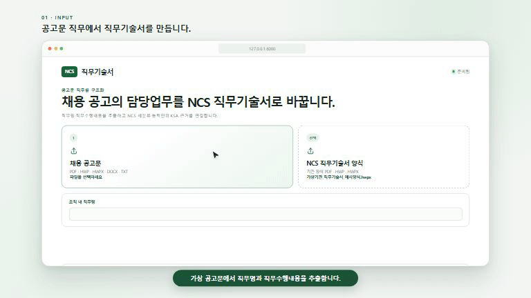
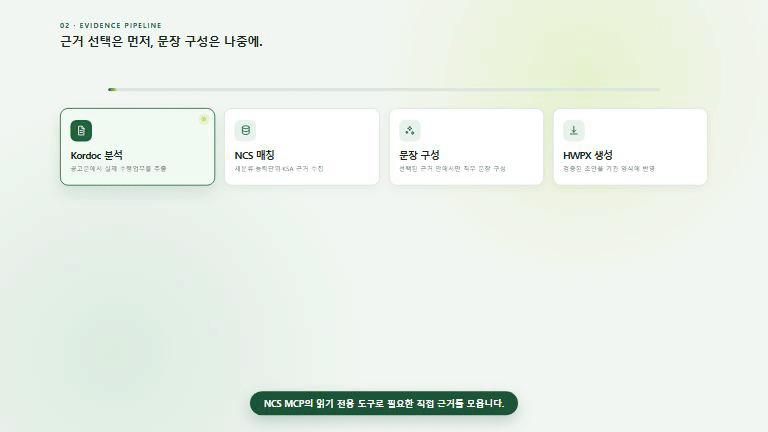
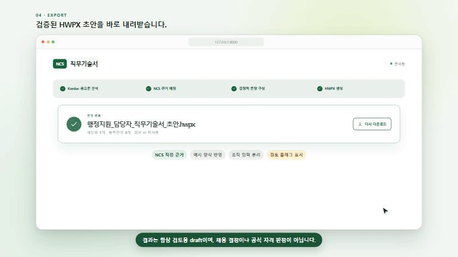

# NCS JD

<p align="center">
  <a href="reports/demo/ncs-jd-demo.mp4">
    
  </a>
</p>

<p align="center">
  <strong><a href="reports/demo/ncs-jd-demo.mp4">▶ 50초 홍보 영상 보기</a></strong><br>
  공고문 입력부터 NCS 근거 매칭, source_ref 검토, HWPX 초안 생성까지
</p>

## 실행 화면 영상

### 1. 공고문과 예시 양식 입력

<p align="center">
  <a href="reports/demo/ncs-jd-input.mp4">
    
  </a>
</p>

<p align="center"><strong><a href="reports/demo/ncs-jd-input.mp4">▶ 입력 화면 MP4로 보기</a></strong></p>

### 2. NCS 세분류·능력단위·근거 연결

<p align="center">
  <a href="reports/demo/ncs-jd-evidence.mp4">
    
  </a>
</p>

<p align="center"><strong><a href="reports/demo/ncs-jd-evidence.mp4">▶ NCS 근거 연결 화면 MP4로 보기</a></strong></p>

### 3. 예시 양식 반영과 HWPX 결과

<p align="center">
  <a href="reports/demo/ncs-jd-result.mp4">
    
  </a>
</p>

<p align="center"><strong><a href="reports/demo/ncs-jd-result.mp4">▶ HWPX 결과 화면 MP4로 보기</a></strong></p>

> 위 영상은 가상의 행정직 공고문에서 직무수행내용을 추출하고, NCS 사무행정 근거와 예시 양식을 반영해 직무기술서를 만드는 흐름을 Remotion으로 시연합니다. 결과물은 항상 검토용 `draft`이며 채용 결정이나 공식 자격 판정 자료가 아닙니다.

---

> NCS 근거 기반 직무기술서 초안 생성기 · Python 패키지: `ncs_jd`

NCS 데이터를 근거로 조직 맞춤형 직무기술서와 직무명세서 초안을 만드는 로컬 프로그램 프로젝트다.

## Windows에서 바로 실행

GitHub의 **Releases**에서 `NCS_JD-windows-x64-v0.1.4.zip`을 내려받아 압축을 완전히 푼 뒤 `NCS_JD.exe`를 실행한다. Python이나 Node.js를 별도로 설치할 필요가 없다. 기본값인 `로컬 전용`은 로그인 없이 동작한다. 생성 화면에서 `AI 정밀 탐색`을 고를 때만 Claude Code 또는 Codex CLI 설치와 구독 로그인이 필요하다. 이 프로그램은 어떤 경로에서도 사용자에게 API 키나 토큰을 요구하지 않는다.

- Windows 10/11 64비트 지원
- 앱과 NCS MCP는 `127.0.0.1`에만 바인딩
- 휴대용 ZIP에 독립 NCS MCP 사이드카와 읽기 전용 serving DB 포함
- `examples/`에 테스트 공고문과 지원 HWPX 양식 포함
- `NCS_JD.exe`와 `NCS_MCP/`의 상대 위치는 변경하지 않아야 함

소스 ZIP은 개발용이다. 일반 사용자는 소스가 아니라 **Releases의 Windows ZIP**을 내려받아야 한다. 첫 실행 진단은 `NCS_JD.exe --diagnostics`, 전체 준비 검사는 `NCS_JD.exe --check-only --no-browser`로 수행할 수 있다.

```text
NCS_JD-windows-x64-v0.1.4/
├─ NCS_JD.exe
├─ NCS_MCP/
│  ├─ NCS_MCP.exe
│  ├─ _internal/
│  └─ data/ncs_jd_serving.db
├─ examples/
│  ├─ administrative-support-announcement.txt
│  └─ ncs-jd-supported-template.hwpx
└─ README_FIRST.txt
```

애플리케이션은 NCS DB를 직접 열지 않는다. `NCS_JD.exe → HTTP/MCP → NCS_MCP.exe → 읽기 전용 serving DB` 경계를 유지하며, 앱이 명시적으로 사용하는 도구는 `ncs_search`, `ncs_unit_detail`, `ncs_analysis`뿐이다.

이 프로젝트는 `C:\workspace\NCS_MCP`와 분리해서 개발한다. NCS 원본 SQLite DB를 직접 수정하거나 복제 로직을 애플리케이션 내부에 넣지 않고, 기존 NCS MCP의 읽기 전용 HTTP/MCP 도구를 데이터 공급 경계로 사용한다.

## 현재 상태

- 사용자 흐름: 실행 방식(`로컬 전용` / `AI 정밀 탐색`) → 공고문/양식 업로드 → 직무 정보 입력 → 생성
- 결정적 산출본: `ncs_job_profile_v1` JSON을 기준본으로 생성 후 HTML/검토용 출력/ HWPX 렌더링
- 기본 출력 경로: 검증된 HWPX 출력 + `ncs_jd.agent_draft/v1` JSON 저장/재열기
- 종료 조건/보장 범위:
  - 사무행정 가상 공고 입력 시 추출 → NCS 매칭 → HWPX 종단 검증
  - 합성 fixture 기반으로 복합 직무(전기시설 유지보수/승강기설치/소방안전관리) 회귀 검증
- 생성 규칙: `로컬 전용`은 전 구간 결정적 규칙으로 동작
- 실행 조건: `로컬 전용`은 API 키/로그인/CLI 설치가 불필요, `AI 정밀 탐색`은 선택된 CLI 로그인 필요
- 보안 경계: `NCS_JD.exe → NCS_MCP.exe`는 `127.0.0.1`만 사용하고 NCS DB 직접 접근은 없음
- 배포 산출물: 휴대용 ZIP(앱 + MCP 사이드카 + 읽기 전용 serving DB)

## AGENTS 기준 반영 검증 체크리스트

변경 후 최소 확인 대상은 다음과 같습니다.

- `ncs_job_profile_v1` JSON 스키마/Pydantic 검증
- `ncs_search`, `ncs_unit_detail`, `ncs_analysis` 모킹/계약 테스트
- NCS 기반 항목의 `source_ref` 누락 없음 확인
- 제외 업무(negative scope)는 결과에 재등장하지 않음
- LLM OFF 동일 입력 결정성 유지
- MCP 장애/빈 결과/미흡한 근거 처리 검증
- 원본 NCS DB 쓰기 경로 없음(직접 파일 열기/수정 차단)

필수 확인이 필요한 항목은 문서에 그대로 남기고, 구현 단계에서 누락 시 기능 토글/테스트부터 보강하세요.

## 입력과 처리 흐름

1. 공고문(PDF/HWP/HWPX/DOCX/TXT)을 올리거나 본문을 붙여넣고, 필요하면 직무명과 선택 양식(PDF/HWP/HWPX)을 입력한다.
2. Kordoc이 직무명과 직무수행내역, 문서·양식 구조를 추출한다.
3. 수행내역의 핵심 대상어와 행위어로 NCS 세분류를 결정하고, 최대 25개 관련 능력단위를 확장한다.
4. `ncs_unit_detail`에서 능력단위요소·수행준거·원문 KSA를 수집한다.
5. 결정적 JobProfile을 먼저 만들고 `source_ref` 완전성을 검증한다.
6. 공고문 업무와 선택한 NCS 근거만으로 결정적 초안을 조립한다. 생성형 AI 재서술 단계는 실행하지 않는다.
7. 업로드 양식의 필드명을 결정적 별칭 규칙으로 먼저 매핑한다. 남은 필드명은 로그인된 CLI가 있을 때만 구조화 출력으로 보완하며, CLI가 없거나 실패하면 별칭 규칙 결과를 그대로 쓴다. 업로드 양식을 실제 반영할 수 없으면 표준 양식으로 조용히 대체하지 않고 오류와 원인을 표시한다.

3~6단계는 `로컬 전용`의 결정적 경로다. `AI 정밀 탐색`을 고르면 이 구간을 선택한 CLI 에이전트가 NCS MCP를 반복 조회하며 대신 수행하고, 결과는 검토 화면에서 항목별로 고칠 수 있다.

한 공고가 여러 세분류에 걸치면 능력단위를 주 세분류에 많이, 보조 세분류에 적게 배분한다. 괄호 안에 설비나 업무가 여러 개 나열된 복합 문구는 항목별 검색어로 분해해 각각 매칭한다. `기타 소속 부서에서 부여한 업무` 같은 포괄 문구는 조직 입력으로 보존하되 NCS 선정 근거에서는 제외한다. 회귀 검증은 저장소에 포함된 가상 공고문과 합성 fixture로 수행하며, 실제 채용공고문과 그 산출물은 저장소에 두지 않는다.

## 외부 AI 없는 NCS 매칭

공고문 문장을 보고 NCS DB에서 근거를 가져오는 데 생성형 AI는 필요하지 않다. 실행 앱은 다음 과정을 로컬에서 결정적으로 수행한다.

- Kordoc으로 공고문의 직무명·담당 업무·자격·우대 항목과 원문 위치를 추출한다.
- 업무 문장에서 조사와 범용어를 제거하고 대상어·행위어·동의어 검색어를 만든다.
- `ncs_search` 결과를 문자 2-gram 유사도, 직무 의도, 업무별 검색 적중 수로 점수화한다.
- 선택한 세분류와 능력단위만 `ncs_unit_detail`로 확장하고 수행준거·KSA 원문을 수집한다.
- 모든 NCS 기반 문장에 `source_ref`를 연결하고, 근거가 약하거나 비어 있으면 임의로 채우지 않고 `review_flags`에 남긴다.

이 경로는 AI 서비스 장애·사용량·로그인 상태에 영향을 받지 않는다. 동일한 공고문, 동일한 NCS 데이터, 동일한 프로그램 버전은 동일한 구조화 결과를 만든다. 표현이 크게 다른 업무 문장 때문에 후보가 애매하면 사실을 추측하지 않고 매칭 근거와 검토 필요 상태를 결과에 표시한다.

대가는 분명하다. 문자 유사도 기반 매칭이라 공고 문구가 NCS 표현과 많이 다르면 능력단위 근거가 얕게 잡히고, 본문도 NCS 원문을 조립한 정형 문장에 가깝다. 화면의 `로컬 전용` 설명에 이 한계를 그대로 적어 두어, 빠르다는 이유만 보고 고르지 않도록 했다.

## AI 정밀 탐색 선택 옵션 (CLI 구독 로그인)

공고 문구가 NCS 표현과 크게 달라 결정적 검색이 얕은 근거만 찾을 때, 생성 화면에서 `AI 정밀 탐색`을 고를 수 있다. 이 경로는 API 키가 아니라 [Claude Code CLI](https://docs.claude.com/en/docs/claude-code) 또는 Codex CLI의 구독 로그인을 사용한다.

화면 순서가 곧 결정 순서다. 실행 방식이 공고문 입력보다 위에 있고, 그 안에서 먼저 `로컬 전용`과 `AI 정밀 탐색` 중 하나를 고른 뒤 어느 AI를 쓸지 고른다.

Claude와 Codex 카드는 항상 화면에 있다. `AI 정밀 탐색`을 고르기 전에는 흐리게 표시되고 선택·로그인 버튼이 눌리지 않으며, 상태 배지는 `대기`다. 로그인 상태 조회는 `AI 정밀 탐색`을 고른 순간에만 시작하므로 고르지도 않은 AI가 미리 `로그인됨`으로 보이지 않는다. 둘 다 로그인되어 있어도 자동으로 선택되지 않는다. 선택 가능한 AI가 하나뿐일 때만 그 하나가 자동으로 선택되고, 그 외에는 사람이 직접 고른다. 로그아웃된 AI는 선택할 수 없고, 선택돼 있던 AI가 로그아웃되면 선택이 해제되어 제출 시점에 실패하지 않는다.

- 사전 준비: `claude` 또는 `codex` CLI를 설치한다. 로그인은 화면의 로그인 버튼으로 시작할 수 있으며, 실제 인증은 해당 CLI가 자체 창에서 처리한다.
- 자격은 CLI 자체 저장소에만 남는다. 프로그램은 토큰이나 키 환경변수를 만들지도, 자식 프로세스에 넘기지도, 기록하지도 않는다. 자식 프로세스에 넘기는 환경변수는 `PATH`·`TEMP` 등 실행에 필요한 목록으로 한정한다.
- Claude와 Codex 모두 같은 제약 아래 실행한다. Claude는 `--mcp-config`와 `--strict-mcp-config`로, Codex는 `--ignore-user-config`·`--ephemeral`과 읽기 전용 샌드박스(`-s read-only`, `--disable shell_tool`) 위의 명령줄 재정의로 건다. 어느 쪽이든 사용자의 다른 MCP 서버 설정은 무시하고, 이 프로그램의 NCS MCP만 본다.
- 허용 도구는 읽기 전용 `ncs_search`와 `ncs_unit_detail` 두 개뿐이다. 사용자의 파일시스템·셸·웹 검색에는 접근할 수 없다.
- 단계 수는 미리 알 수 없다. 검색과 상세 조회를 반복하는 동안 도구 호출 단위로 진행 상황을 표시하며 보통 수 분이 걸린다.
- 대분류·중분류·소분류·세분류는 에이전트에게 묻지 않는다. 채택한 능력단위 코드를 NCS에서 다시 조회해 그 분류를 그대로 적는다. 조회하지 못한 능력단위는 분류에서 빼고 검토 필요 사항으로 남긴다.
- CLI가 없거나 로그아웃·사용량 한도 상태면 결정적 경로로 조용히 우회하지 않고 `공식 CLI 로그인이 필요합니다`, `제공자 사용량 한도에 도달했습니다`처럼 원인을 구분해 표시한다. Claude는 종료 코드와 stderr로, Codex는 stdout의 `error`·`turn.failed` 이벤트로 실패를 알리므로 네 경로를 모두 모아 분류한다.

에이전트 결과 역시 조직 승인 문장이 아니라 검토용 `draft`다. 검토 화면에서 항목을 직접 고친 뒤 HWPX로 내보내거나 JSON으로 저장한다.

## 양식 필드명 매핑 (CLI 로그인, 자동)

기관 양식의 필드명이 표준 NCS 명칭과 크게 다르면 결정적 별칭 규칙만으로는 연결되지 않는 칸이 남는다. 양식을 올렸고 CLI가 로그인되어 있으면 남은 필드명 연결을 CLI가 보완한다. 별도 선택 항목이 아니며 키도 필요 없다.

- CLI에는 양식의 필드명과 짧게 제한한 기존 예시값만 보내며, 생성된 JobProfile·NCS 근거·출력 문장은 보내지 않는다.
- 응답은 양식에서 실제로 추출된 필드명과 내부 키만 반환하도록 JSON Schema로 제한한다.
- 결과는 필드 연결만 보완하며 값을 새로 쓰거나 사실·자격·학력·경력·법적 의무를 추가할 수 없다.
- CLI가 없거나 로그아웃 상태이거나 매핑이 실패하면 결정적 별칭 규칙 결과를 그대로 사용한다. 이 단계의 실패는 문서 생성을 막지 않는다.

## 핵심 산출물

최초 산출물은 `ncs_job_profile_v1` JSON이다.

- `job_description`: 직무 목적, 책무, 과업, 책임·권한, KPI, 협업·보고관계
- `person_specification`: 지식·기술·태도, 숙련수준, 경험, 관련 자격 참고
- `provenance`: 각 NCS 기반 문장의 원천 능력단위·요소·수행준거·KSA 참조
- `review_flags`: 미확정 조직 정보, 약한 근거, 자료 미수집 상태

AI 정밀 탐색으로 만든 초안은 검토 화면에서 `ncs_jd.agent_draft/v1` JSON으로 내려받을 수 있다. 이 파일에는 검토한 항목값, 조회한 능력단위 코드, 검토 필요 사항, 올린 기관 양식이 함께 담기므로 나중에 다시 열어 공고문 재입력이나 재실행 없이 같은 양식으로 HWPX를 만들 수 있다. 파일은 사용자가 고른 위치에만 저장하며 서버나 브라우저 저장소에는 남기지 않는다. 검토 화면은 인쇄·PDF 저장도 지원하며, 인쇄물에도 검토용 초안이라는 고지를 남긴다.

HWPX 출력은 이 JSON을 렌더링한다. 빈 HWPX 양식은 대상 항목을 안전하게 단일 매칭할 수 있을 때 원본 구조를 보존한다. 값이 이미 채워진 HWP·HWPX와 PDF 예시 양식은 필드명을 새 값에 연결하고 기존 예시값과 예시 고유 문구를 제거한 뒤 HWPX로 재구성한다. 기본 별칭 규칙으로 충분하지 않을 때만 로그인된 CLI의 필드명 매핑을 추가한다. 최소 필드 범위와 `직무수행내용`을 안전하게 식별하지 못하거나 매핑이 중복·모호하면 `template_not_applied`로 중단한다. 양식이 없을 때만 표준 HWPX를 사용한다.

## 읽기 순서

1. [구현 계획](docs/IMPLEMENTATION_PLAN.md)
2. [MCP 연동 계약](docs/MCP_INTEGRATION.md)
3. [JobProfile 데이터 계약](docs/JOB_PROFILE_CONTRACT.md)
4. [문서 처리 파이프라인](docs/DOCUMENT_PIPELINE.md)
5. [프로젝트 작업 규칙](AGENTS.md)

## 확정된 프로젝트 경계

- NCS 원천 사실은 기존 NCS MCP에서 읽는다.
- 신규 프로젝트는 NCS DB에 쓰지 않는다.
- NCS 수행준거와 KSA를 조직의 최종 직무 요건으로 자동 확정하지 않는다.
- 조직 고유 KPI, 권한, 보고관계, 경력 요건은 사용자 입력으로 구분한다.
- 모든 생성 문서는 기본적으로 `draft`다.
- 자동화가 NCS 원천의 `human_reviewed`, `accepted`, `reviewed` 상태를 만들지 않는다.
- Kordoc 추출값과 NCS 검색 결과는 후보이며 사용자 확정값으로 위장하지 않는다.
- HWPX는 검증된 JSON의 표현이며 별도 사실 저장소가 아니다.

## 기술 스택

- Python 3.12
- FastAPI
- Jinja2 기반 단일 생성 화면
- Pydantic 기반 JSON 계약
- Python MCP SDK를 감싼 `NcsSourcePort`
- Node.js JSON 브리지로 격리한 Kordoc 4.2.9
- pytest

로컬 서버는 기본적으로 `127.0.0.1`에만 바인딩한다.

## 로컬 실행

Python 웹 의존성과 Node Kordoc 의존성을 설치한 뒤 실행한다.

```powershell
python -m pip install -e ".[web,mcp]"
npm ci
.\scripts\run_local.ps1
```

`run_local.ps1`과 데스크톱 런처는 `C:\workspace\NCS_MCP`의 격리 Python을 찾아 HTTP 서버를 직접 시작한다. health 응답이 읽기 전용이고 operator 도구가 0개인지 확인한 뒤 NCS JD를 `http://127.0.0.1:8000`에 연다.

Kordoc은 공식 `4.2.9`를 정확히 고정한다. 단일 EXE에는 PDF 텍스트층 처리에 필요한 `pdfjs-dist`만 포함하고 이미지 OCR용 모델은 포함하지 않는다. 스캔 이미지만 있는 PDF는 먼저 OCR된 PDF로 변환해야 한다.

## Windows 실행 파일

프로젝트 루트의 `NCS_JD.exe`는 개발용 단일 앱 빌드다. 다른 PC에 전달할 정식 산출물은 앱 옆에 독립 NCS MCP 사이드카와 serving DB를 배치한 휴대용 ZIP이다. 실행하면 안전한 NCS MCP health/readiness를 확인하고 `127.0.0.1:8000`에서 서버를 연 뒤 기본 브라우저를 시작한다.

```powershell
.\scripts\build_windows_onefile.ps1 -PythonExecutable .\.venv-build312\Scripts\python.exe -Clean
.\scripts\smoke_windows_exe.ps1 -Executable NCS_JD.exe
.\scripts\package_windows_portable.ps1 -PythonExecutable .\.venv-build313\Scripts\python.exe
.\scripts\smoke_windows_portable_e2e.ps1
```

실행 조건, 종료 코드, 로그 위치, Node/Kordoc 포함 정책은 [Windows 배포 안내](docs/WINDOWS_DISTRIBUTION.md)를 참고한다. 전체 12GB+ NCS 원천 DB는 배포본에 포함하지 않는다. 휴대용 배포에는 JD 생성에 필요한 표만 추린 약 117MB 읽기 전용 serving DB만 포함하며 AI 자격증명은 애초에 요구하지 않는다.

## NCS 데이터 출처

NCS 분류·능력단위 데이터의 제공기관은 한국산업인력공단이다. 배포 데이터는 전체 원천 DB가 아니라 JD 조회에 필요한 읽기 전용 파생본이며, 원문은 조직의 승인 문장이나 채용요건으로 자동 확정하지 않는다. 공공데이터포털의 NCS 기준정보 API는 이용허락범위를 “제한 없음”으로 안내하지만, 공개 재배포 전에는 실제 포함 필드별 출처와 NCS 저작권 정책을 함께 재확인해야 한다.

- 한국산업인력공단 NCS 기준정보: https://www.data.go.kr/data/15128213/openapi.do
- NCS 홈페이지 저작권정책: https://www.ncs.go.kr/blind/index.do
